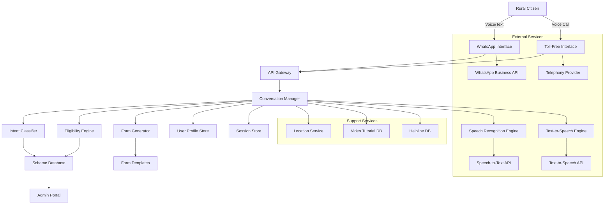
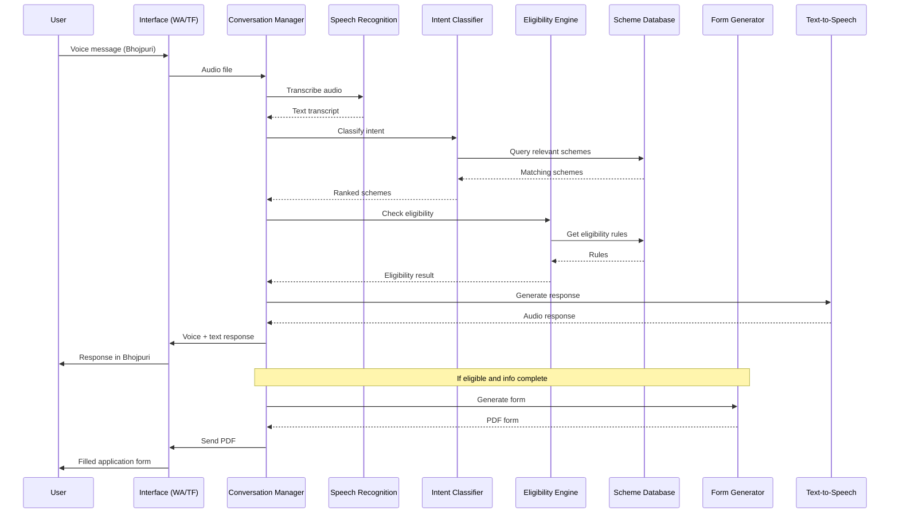

# Design Document: Jan-Sahayak (Voice-First Civil Caseworker)

 

## Overview

 

Jan-Sahayak is a voice-first AI system that democratizes access to Indian welfare schemes across multiple sectors by enabling citizens to discover eligibility and generate application forms through natural language conversations in vernacular dialects. The system covers agriculture, disability support, women empowerment, health, and education scholarship sectors, operating over WhatsApp and toll-free numbers to eliminate literacy, language, and accessibility barriers while removing dependency on middlemen.

 

The architecture follows a microservices pattern with clear separation between voice processing, conversation management, eligibility evaluation, and form generation. The system is designed for low-bandwidth environments, supports offline-first interactions where possible, and handles sector-specific workflows with sensitivity and domain expertise.

 

### Key Design Principles

 

1. **Voice-First**: All interactions prioritize voice over text

2. **Vernacular-Native**: Support for 10+ Indian languages and dialects

3. **Low-Bandwidth Optimized**: Functions on 2G networks

4. **Privacy-Preserving**: Minimal data retention, strong encryption

5. **Offline-Resilient**: Graceful degradation and session resumption

6. **Extensible**: Easy addition of new schemes without code changes

 

## Architecture

 

### High-Level Architecture

 



 

### Component Interaction Flow

 



 

## Components and Interfaces

 

### 1. Voice Input Module

 

**Responsibility**: Accept and validate audio input from multiple channels

 

**Interface**:

```typescript

interface VoiceInputModule {

  acceptAudio(source: AudioSource, format: AudioFormat): AudioFile

  validateQuality(audio: AudioFile): QualityScore

  segmentLongAudio(audio: AudioFile, maxDuration: number): AudioFile[]

  requestRetry(reason: string): void

}

 

type AudioSource = 'whatsapp' | 'tollfree'

type AudioFormat = 'mp3' | 'ogg' | 'aac' | 'wav' | 'pcm'

type QualityScore = { score: number, issues: string[] }

```

 

**Key Behaviors**:

- Accepts audio in multiple formats (MP3, OGG, AAC, WAV)

- Validates audio quality (signal-to-noise ratio, duration)

- Segments audio longer than 2 minutes

- Requests retry if quality is below threshold

 

### 2. Speech Recognition Engine

 

**Responsibility**: Convert vernacular speech to text with high accuracy

 

**Interface**:

```typescript

interface SpeechRecognitionEngine {

  transcribe(audio: AudioFile, language: Language): TranscriptionResult

  detectLanguage(audio: AudioFile): Language

  applyDialectModel(text: string, dialect: Dialect): string

  handleCodeMixing(text: string): string

}

 

type Language = 'hi' | 'bho' | 'mai' | 'mr' | 'bn' | 'ta' | 'te' | 'gu' | 'pa' | 'kn'

type Dialect = 'bhojpuri' | 'maithili' | 'warli' | 'awadhi' | 'magahi'

type TranscriptionResult = {

  text: string

  confidence: number

  language: Language

  alternatives?: string[]

}

```

 

**Key Behaviors**:

- Achieves minimum 85% accuracy for supported languages

- Applies dialect-specific models for regional variations

- Handles code-mixing (Hindi-English, vernacular-Hindi)

- Flags low-confidence transcriptions (< 70%) for clarification

- Applies noise reduction preprocessing

 

**Implementation Notes**:

- Use pre-trained models from Google Speech-to-Text, Azure Speech, or Bhashini (Indian government initiative)

- Fine-tune on vernacular datasets

- Maintain separate acoustic models for each dialect

- Cache common phrases for faster processing

 

### 3. Intent Classifier

 

**Responsibility**: Map user queries to relevant welfare schemes

 

**Interface**:

```typescript

interface IntentClassifier {

  classifyIntent(text: string, context: ConversationContext): Intent[]

  rankSchemes(intents: Intent[], userProfile: UserProfile): RankedScheme[]

  identifyScenario(text: string): Scenario

}

 

type Intent = {

  schemeCategory: SchemeCategory

  confidence: number

  keywords: string[]

}

 

type SchemeCategory =

  | 'agricultural_distress'

  | 'health_insurance'

  | 'education_support'

  | 'housing'

  | 'employment'

  | 'pension'

  | 'disability_support'

  | 'women_welfare'

  | 'maternal_health'

  | 'scholarship'

  | 'skill_development'

  | 'assistive_devices'

  | 'women_entrepreneurship'

  | 'women_safety'

 

type RankedScheme = {

  scheme: Scheme

  relevanceScore: number

  reason: string

}

 

type Scenario = {

  category: SchemeCategory

  urgency: 'high' | 'medium' | 'low'

  keywords: string[]

}

```

 

**Key Behaviors**:

- Identifies at least one relevant scheme category per query

- Ranks multiple schemes by relevance

- Recognizes common scenarios (crop damage, medical emergency, etc.)

- Handles ambiguous queries by asking clarifying questions

- Maps to both central and state schemes

 

**Implementation Notes**:

- Use transformer-based models (mBERT, IndicBERT) fine-tuned on scheme descriptions

- Maintain keyword-to-scheme mappings in Scheme Database

- Use semantic similarity for fuzzy matching

- Consider user location for state-specific schemes

 

### 4. Eligibility Engine

 

**Responsibility**: Evaluate user eligibility against scheme rules

 

**Interface**:

```typescript

interface EligibilityEngine {

  evaluateEligibility(scheme: Scheme, userInfo: UserInfo): EligibilityResult

  identifyMissingInfo(scheme: Scheme, userInfo: UserInfo): string[]

  explainIneligibility(result: EligibilityResult): string

}

 

type UserInfo = {

  age?: number

  gender?: string

  income?: number

  landHolding?: number

  caste?: string

  disability?: boolean

  disabilityType?: 'locomotor' | 'visual' | 'hearing' | 'speech' | 'intellectual' | 'mental' | 'multiple'

  disabilityPercentage?: number

  disabilityCertificate?: boolean

  maritalStatus?: 'single' | 'married' | 'widowed' | 'divorced'

  pregnancyStatus?: boolean

  numberOfChildren?: number

  studentStatus?: boolean

  educationLevel?: string

  courseType?: string

  previousYearMarks?: number

  location: Location

  occupation?: string

  familySize?: number

  rationCardType?: string

  healthCondition?: string

  existingInsurance?: boolean

}

 

type EligibilityResult = {

  status: 'eligible' | 'likely_eligible' | 'not_eligible'

  confidence: number

  matchedCriteria: string[]

  unmatchedCriteria: string[]

  missingInfo: string[]

}

 

type Location = {

  state: string

  district: string

  block?: string

  village?: string

}

```

 

**Key Behaviors**:

- Evaluates all mandatory eligibility criteria

- Returns confidence score based on information completeness

- Identifies missing information needed for determination

- Explains which criteria are not met for ineligible cases

- Checks multiple schemes simultaneously

- Uses current year thresholds from database

 

**Implementation Notes**:

- Store eligibility rules as evaluable expressions (JSON Logic, rule engine)

- Support complex rules (age ranges, income thresholds, location-based)

- Handle missing data gracefully with "likely eligible" status

- Cache eligibility results for session duration

 

### 5. Conversation Manager

 

**Responsibility**: Orchestrate multi-turn dialogues and maintain context

 

**Interface**:

```typescript

interface ConversationManager {

  startSession(userId: string, channel: Channel): Session

  processMessage(sessionId: string, message: Message): Response

  askQuestion(sessionId: string, question: Question): void

  updateContext(sessionId: string, info: Partial<UserInfo>): void

  resumeSession(sessionId: string): Session

  endSession(sessionId: string): void

}

 

type Channel = 'whatsapp' | 'tollfree'

 

type Session = {

  id: string

  userId: string

  channel: Channel

  language: Language

  context: ConversationContext

  startTime: Date

  lastActivity: Date

  state: SessionState

}

 

type ConversationContext = {

  currentScheme?: Scheme

  userInfo: Partial<UserInfo>

  collectedInfo: Map<string, any>

  conversationHistory: Message[]

  currentStep: WorkflowStep

}

 

type WorkflowStep =

  | 'greeting'

  | 'problem_identification'

  | 'scheme_recommendation'

  | 'eligibility_check'

  | 'info_collection'

  | 'form_generation'

  | 'service_center_location'

  | 'tutorial_sharing'

  | 'helpline_provision'

 

type SessionState = 'active' | 'idle' | 'completed' | 'expired'

 

type Message = {

  role: 'user' | 'assistant'

  content: string

  timestamp: Date

  audioUrl?: string

}

 

type Response = {

  text: string

  audio?: AudioFile

  attachments?: Attachment[]

  nextAction?: string

}

 

type Question = {

  text: string

  field: string

  validationRule?: ValidationRule

  examples?: string[]

}

```

 

**Key Behaviors**:

- Maintains conversation context across multiple turns

- Asks one question at a time for simplicity

- Allows users to correct previously provided information

- Sends idle prompts after 5 minutes of inactivity

- Supports sessions up to 30 minutes

- Orchestrates the complete workflow from problem to solution

- Handles session resumption after disconnection

 

**Implementation Notes**:

- Store session state in Redis for fast access

- Implement state machine for workflow steps

- Use conversation templates for common flows

- Support context switching (going back, changing topic)

- Implement timeout handling for idle sessions

 

### 6. Scheme Database

 

**Responsibility**: Store and retrieve welfare scheme information

 

**Interface**:

```typescript

interface SchemeDatabase {

  getScheme(schemeId: string): Scheme

  searchSchemes(query: SchemeQuery): Scheme[]

  getEligibilityRules(schemeId: string): EligibilityRule[]

  getFormTemplate(schemeId: string): FormTemplate

  updateScheme(scheme: Scheme): void

  addScheme(scheme: Scheme): void

}

 

type Scheme = {

  id: string

  name: string

  nameTranslations: Map<Language, string>

  description: string

  descriptionTranslations: Map<Language, string>

  category: SchemeCategory

  level: 'central' | 'state'

  state?: string

  benefits: string[]

  eligibilityCriteria: EligibilityRule[]

  requiredDocuments: Document[]

  applicationProcess: string[]

  deadline?: Date

  helplineNumber?: string

  officialWebsite?: string

  keywords: string[]

 

  version: number

  lastUpdated: Date

}

 

type SchemeQuery = {

  category?: SchemeCategory

  keywords?: string[]

  location?: Location

  userProfile?: UserInfo

}

 

type EligibilityRule = {

  field: string

  operator: 'eq' | 'gt' | 'lt' | 'gte' | 'lte' | 'in' | 'contains'

  value: any

  mandatory: boolean

}

 

type FormTemplate = {

  templateId: string

  fields: FormField[]

  format: 'pdf' | 'docx'

  officialTemplate: boolean

}

 

type Document = {

  name: string

  mandatory: boolean

  description: string

  whereToObtain?: string

  validityPeriod?: string

}

```

 

**Key Behaviors**:

- Stores comprehensive scheme information with translations

- Supports versioning for scheme updates

- Enables keyword-based search

- Maintains eligibility rules as evaluable expressions

- Links schemes to form templates

- Supports both central and state schemes

 

**Implementation Notes**:

- Use PostgreSQL or MongoDB for scheme storage

- Index on keywords, category, and location for fast search

- Store eligibility rules in JSON format for flexibility

- Maintain audit trail for scheme updates

- Support bulk import from government APIs

 

### 7. Form Generator

 

**Responsibility**: Create filled PDF application forms from collected information

 

**Interface**:

```typescript

interface FormGenerator {

  generateForm(scheme: Scheme, userInfo: UserInfo): FormResult

  mapDataToFields(data: UserInfo, template: FormTemplate): FilledForm

  validateCompleteness(form: FilledForm): ValidationResult

  compressForWhatsApp(pdf: Buffer): Buffer

}

 

type FormResult = {

  pdf: Buffer

  summary: FormSummary

  missingFields: string[]

  requiredDocuments: Document[]

}

 

type FilledForm = {

  fields: Map<string, any>

  signatureFields: string[]

  attachmentFields: string[]

}

 

type FormSummary = {

  schemeName: string

  applicantName: string

  filledFields: string[]

  documentsNeeded: string[]

  submissionInstructions: string

}

 

type ValidationResult = {

  isComplete: boolean

  missingMandatoryFields: string[]

  warnings: string[]

}

```

 

**Key Behaviors**:

- Maps voice-collected data to form fields

- Generates PDFs matching official templates

- Marks signature and attachment fields clearly

- Includes summary page with all information

- Compresses PDFs for WhatsApp (under 2MB)

- Validates form completeness before generation

 

**Implementation Notes**:

- Use PDF libraries (PDFKit, pdf-lib) for generation

- Maintain field mapping configurations per scheme

- Support multiple form formats (PDF, fillable PDF)

- Include QR codes for verification where applicable

- Generate forms in user's preferred language when possible

 

### 8. Text-to-Speech Engine

 

**Responsibility**: Convert text responses to natural vernacular speech

 

**Interface**:

```typescript

interface TextToSpeechEngine {

  synthesize(text: string, language: Language, voice: VoiceProfile): AudioFile

  adjustSpeed(audio: AudioFile, speedFactor: number): AudioFile

  selectVoice(language: Language, gender?: 'male' | 'female'): VoiceProfile

}

 

type VoiceProfile = {

  language: Language

  dialect?: Dialect

  gender: 'male' | 'female'

  voiceId: string

}

```

 

**Key Behaviors**:

- Converts text to natural-sounding speech

- Supports 10+ vernacular languages

- Adjusts speaking pace for elderly users

- Uses appropriate voices for each dialect

- Pronounces technical terms clearly

 

**Implementation Notes**:

- Use Google Text-to-Speech, Azure TTS, or Bhashini

- Maintain voice profiles for each language

- Apply SSML for pronunciation control

- Cache common phrases for faster response

- Support both streaming and file-based output

 

## Sector-Specific Design Considerations

 

### Disability Sector

 

**Special Requirements**:

- Sensitive information collection about disability type and percentage

- Integration with UDID (Unique Disability ID) system

- Support for assistive technology compatibility (screen readers)

- Guidance to disability assessment centers

 

**Data Model Extensions**:

```typescript

type DisabilityInfo = {

  type: DisabilityType[]

  percentage: number

  certificateNumber?: string

  certificateIssueDate?: Date

  assessmentCenter?: string

  udidNumber?: string

  assistiveDevicesOwned?: string[]

}

 

type DisabilityType =

  | 'locomotor'

  | 'visual'

  | 'hearing'

  | 'speech'

  | 'intellectual'

  | 'mental_illness'

  | 'multiple_disabilities'

  | 'chronic_neurological'

```

 

**Key Schemes**:

- UDID Card Registration

- Disability Pension (State-specific)

- ADIP (Assistive Devices)

- Deendayal Disabled Rehabilitation Scheme

- Special Education Support

- Accessible India Campaign benefits

 

### Women Empowerment Sector

 

**Special Requirements**:

- Privacy-first approach for sensitive topics

- Emergency helpline integration (181, 1091)

- Connection to female counselors when needed

- Information about women's help desks and One Stop Centers

 

**Data Model Extensions**:

```typescript

type WomenSpecificInfo = {

  maritalStatus: MaritalStatus

  widowStatus?: boolean

  widowCertificateNumber?: string

  pregnancyStatus?: boolean

  expectedDeliveryDate?: Date

  numberOfGirlChildren?: number

  numberOfBoyChildren?: number

  selfHelpGroupMember?: boolean

  entrepreneurshipInterest?: boolean

  domesticViolenceSupport?: boolean

}

 

type MaritalStatus = 'single' | 'married' | 'widowed' | 'divorced' | 'separated'

```

 

**Key Schemes**:

- Pradhan Mantri Matru Vandana Yojana (Maternity Benefit)

- Beti Bachao Beti Padhao

- Mahila Shakti Kendra

- Women's Self-Help Group schemes

- Widow Pension

- Sukanya Samriddhi Yojana

- Women Entrepreneurship Loans (Mudra, Stand-Up India)

 

### Health Sector

 

**Special Requirements**:

- Medical privacy and confidentiality

- Emergency number provision (108 ambulance)

- Integration with Ayushman Bharat database

- Hospital empanelment information

- Disease-specific support programs

 

**Data Model Extensions**:

```typescript

type HealthInfo = {

  chronicConditions?: string[]

  currentTreatment?: boolean

  hospitalizationHistory?: boolean

  ayushmanCardNumber?: string

  stateHealthCardNumber?: string

  familyHealthHistory?: string[]

  pregnancyRelated?: boolean

  childHealthConcerns?: boolean

  tbPatient?: boolean

  cancerPatient?: boolean

}

```

 

**Key Schemes**:

- Ayushman Bharat (PM-JAY)

- State Health Insurance Schemes

- Rashtriya Bal Swasthya Karyakram (Child Health)

- Janani Suraksha Yojana (Maternal Health)

- TB Patient Support (Nikshay Poshan Yojana)

- Cancer Treatment Assistance

- Free Drug and Diagnostic Services

 

### Education Scholarship Sector

 

**Special Requirements**:

- Integration with National Scholarship Portal

- Academic year and deadline tracking

- Institution verification process

- Merit and income-based eligibility

- Renewal tracking for continuing students

 

**Data Model Extensions**:

```typescript

type EducationInfo = {

  currentClass?: string

  courseType?: CourseType

  institutionName?: string

  institutionCode?: string

  boardUniversity?: string

  previousYearMarks?: number

  previousYearPercentage?: number

  admissionYear?: number

  feeAmount?: number

  hostelResident?: boolean

  firstGenerationLearner?: boolean

  parentOccupation?: string

  parentIncome?: number

  scholarshipHistory?: ScholarshipRecord[]

}

 

type CourseType =

  | 'pre_matric'

  | 'post_matric_below_graduation'

  | 'post_matric_graduation'

  | 'post_graduation'

  | 'professional_course'

  | 'vocational_training'

  | 'skill_development'

 

type ScholarshipRecord = {

  year: number

  schemeName: string

  amount: number

  status: 'received' | 'pending' | 'rejected'

}

```

 

**Key Schemes**:

- Pre-Matric Scholarships (SC/ST/OBC)

- Post-Matric Scholarships (SC/ST/OBC)

- PM-YASASVI (Vibrant India Scholarship)

- Merit-cum-Means Scholarships

- Minority Scholarships (Maulana Azad, etc.)

- Girl Child Education Schemes

- National Means-cum-Merit Scholarship

- State-specific Scholarships

- Skill Development Schemes (PMKVY)

 

## Cross-Sector Workflows

 

### Multi-Sector Eligibility Check

 

When a user provides demographic information, the system performs parallel eligibility checks across all sectors:

 

```typescript

interface MultiSectorEligibilityEngine {

  checkAllSectors(userInfo: UserInfo): SectorEligibilityResult[]

  rankSchemesByBenefit(results: SectorEligibilityResult[]): RankedScheme[]

  identifySchemeConflicts(schemes: Scheme[]): SchemeConflict[]

  suggestOptimalCombination(schemes: Scheme[]): SchemeBundle

}

 

type SectorEligibilityResult = {

  sector: SchemeSector

  eligibleSchemes: Scheme[]

  potentialBenefit: number

  applicationComplexity: 'easy' | 'medium' | 'complex'

}

 

type SchemeSector =

  | 'agriculture'

  | 'disability'

  | 'women'

  | 'health'

  | 'education'

  | 'housing'

  | 'employment'

  | 'pension'

 

type SchemeConflict = {

  scheme1: Scheme

  scheme2: Scheme

  conflictType: 'mutually_exclusive' | 'duplicate_benefit' | 'income_threshold'

  resolution: string

}

 

type SchemeBundle = {

  schemes: Scheme[]

  totalBenefit: number

  applicationOrder: string[]

  reasoning: string

}

```

 

### Sensitive Topic Handling

 

For sensitive topics (disability, domestic violence, health conditions), the system follows special protocols:

 

```typescript

interface SensitiveTopicHandler {

  detectSensitiveTopic(text: string): SensitiveTopic | null

  applyPrivacyProtocol(topic: SensitiveTopic): PrivacySettings

  offerEmergencySupport(topic: SensitiveTopic): EmergencyResource[]

  useSensitiveLanguage(topic: SensitiveTopic, language: Language): ConversationTemplate

}

 

type SensitiveTopic =

  | 'disability'

  | 'domestic_violence'

  | 'mental_health'

  | 'sexual_assault'

  | 'child_abuse'

  | 'terminal_illness'

  | 'pregnancy_complications'

 

type PrivacySettings = {

  enhancedEncryption: boolean

  limitedLogging: boolean

  anonymizeAnalytics: boolean

  offerCounselorConnection: boolean

}

 

type EmergencyResource = {

  type: 'helpline' | 'center' | 'hospital' | 'police'

  name: string

  number: string

  address?: string

  availability: string

}

```

 

## Data Flow Examples

 

### Example 1: Woman with Disability Seeking Multiple Benefits

 

```

User: "Main ek widow hoon aur mujhe disability bhi hai. Mujhe kya schemes mil sakti hain?"

(I am a widow and I also have a disability. What schemes can I get?)

 

System Flow:

1. Speech Recognition → Transcribe to text

2. Intent Classifier → Identifies: women_welfare + disability_support

3. Conversation Manager → Collects: disability type, percentage, widow certificate, age, income

4. Eligibility Engine → Checks across sectors:

   - Disability Pension (eligible)

   - Widow Pension (eligible - but may conflict with disability pension)

   - Assistive Devices (eligible if certificate available)

   - Health Insurance (eligible)

5. System explains: "Aapko disability pension ya widow pension mein se ek mil sakta hai.

   Disability pension zyada hai. Aapko Ayushman Bharat card bhi mil sakta hai."

6. User chooses disability pension

7. Form Generator → Creates disability pension application

8. System provides: Nearby assessment center, required documents, helpline

```

 

### Example 2: Student from SC Category Seeking Scholarship

 

```

User: "Main 12th class mein hoon. Scholarship ke liye apply karna hai."

(I am in 12th class. I want to apply for scholarship.)

 

System Flow:

1. Speech Recognition → Transcribe

2. Intent Classifier → Identifies: education_support + scholarship

3. Conversation Manager → Collects: class, marks, caste category, family income, institution

4. Eligibility Engine → Checks:

   - Pre-Matric Scholarship (not eligible - 12th is post-matric)

   - Post-Matric Scholarship SC/ST (eligible if SC/ST)

   - Merit-cum-Means (eligible if marks > 50% and income < threshold)

   - State Scholarships (checks based on state)

5. System explains eligible scholarships with amounts

6. User selects Post-Matric SC Scholarship

7. Form Generator → Creates NSP registration form + scholarship application

8. System provides: NSP portal link, institution code, deadline, required documents

```

 

## Technology Stack Recommendations

 

### Core Services

- **API Gateway**: Kong, AWS API Gateway

- **Conversation Manager**: Node.js/Python with state machine (XState, AWS Step Functions)

- **Speech Recognition**: Google Speech-to-Text, Azure Speech, Bhashini API

- **Text-to-Speech**: Google TTS, Azure TTS, Bhashini TTS

- **Intent Classification**: Hugging Face Transformers (IndicBERT), OpenAI API

- **Form Generation**: PDFKit, pdf-lib, Puppeteer

 

### Data Storage

- **Scheme Database**: PostgreSQL with full-text search

- **User Profiles**: PostgreSQL with encryption at rest

- **Session Store**: Redis for fast access

- **Document Storage**: AWS S3, Azure Blob Storage

 

### External Integrations

- **WhatsApp**: Twilio WhatsApp API, Meta WhatsApp Business API

- **Telephony**: Twilio Voice, Exotel, Knowlarity

- **Location Services**: Google Maps API, MapMyIndia

- **Government APIs**: Ayushman Bharat API, NSP API, UDID API

 

### Infrastructure

- **Hosting**: AWS, Azure, Google Cloud

- **Container Orchestration**: Kubernetes

- **Monitoring**: Prometheus, Grafana, ELK Stack

- **CI/CD**: GitHub Actions, GitLab CI

 

## Security and Privacy

 

### Data Protection

- TLS 1.3 for all communications

- AES-256 encryption for data at rest

- Field-level encryption for sensitive data (disability info, health conditions)

- Anonymization of voice recordings after transcription

- GDPR/Indian Data Protection compliance

 

### Access Control

- Role-based access control (RBAC) for admin portal

- API key authentication for external integrations

- Rate limiting to prevent abuse

- Audit logging for all data access

 

### Privacy Features

- User consent for data storage

- Right to deletion (within 48 hours)

- Data minimization (collect only necessary information)

- No third-party data sharing without consent

- Anonymized analytics

 

## Performance Requirements

 

- **Response Time**: < 10 seconds for 95% of requests

- **Concurrent Users**: Support 10,000+ concurrent sessions

- **Bandwidth**: Function on 2G networks (32 kbps minimum)

- **Availability**: 99.5% uptime

- **Scalability**: Auto-scaling based on load

- **Form Generation**: < 5 seconds per form

 

## Monitoring and Analytics

 

### Key Metrics

- Sessions per day/week/month

- Scheme inquiry distribution

- Form generation success rate

- Language distribution

- Average session duration

- User satisfaction scores

- Error rates by component

- Response time percentiles

 

### Dashboards

- Real-time operations dashboard

- Scheme popularity analytics

- User demographics (anonymized)

- System health monitoring

- Error tracking and alerting

 

## Future Enhancements

 

1. **AI-Powered Document Verification**: OCR and validation of uploaded documents

2. **Application Status Tracking**: Integration with government portals for status updates

3. **Proactive Notifications**: Alert users about new schemes, deadlines, renewals

4. **Community Features**: Connect users with similar needs, success stories

5. **Multilingual Chatbot**: Text-based alternative for users who prefer typing

6. **Video KYC**: Remote identity verification for schemes requiring it

7. **Blockchain Integration**: Tamper-proof application records

8. **Predictive Eligibility**: Suggest schemes before users ask based on profile

 

## Correctness Properties

 

### Property 1: Voice Input Acceptance

**Validates: Requirement 1**

 

For all supported audio formats (MP3, OGG, AAC, WAV) and valid audio files:

- The system SHALL successfully accept and process the audio input

- The system SHALL NOT reject valid audio files due to format issues

 

### Property 2: Speech Recognition Accuracy

**Validates: Requirement 2**

 

For all supported languages and clear audio input:

- Transcription accuracy SHALL be >= 85%

- Low confidence transcriptions (< 70%) SHALL be flagged for clarification

 

### Property 3: Intent Classification Completeness

**Validates: Requirement 3**

 

For all user queries describing a problem or need:

- The system SHALL identify at least one relevant scheme category

- The system SHALL NOT return empty results for valid welfare-related queries

 

### Property 4: Eligibility Consistency

**Validates: Requirement 4**

 

For identical user information and scheme criteria:

- The eligibility determination SHALL be consistent across multiple evaluations

- The system SHALL NOT produce different eligibility results for the same inputs

 

### Property 5: Form Field Completeness

**Validates: Requirement 7**

 

For all generated application forms:

- All mandatory fields SHALL be filled with collected information

- The system SHALL NOT generate forms with missing mandatory fields

- The system SHALL clearly mark fields requiring user signature or document attachment

 

### Property 6: Multi-Language Consistency

**Validates: Requirement 13**

 

For all supported languages:

- Scheme information SHALL be semantically equivalent across language translations

- Eligibility criteria SHALL produce identical results regardless of interaction language

 

### Property 7: Privacy Compliance

**Validates: Requirement 15**

 

For all user data:

- Personal information SHALL be encrypted in transit (TLS 1.3+)

- Personal information SHALL be encrypted at rest (AES-256)

- Data deletion requests SHALL complete within 48 hours

 

### Property 8: Cross-Sector Eligibility Accuracy

**Validates: Requirement 29**

 

For users eligible for multiple sectors:

- The system SHALL identify all eligible schemes across all sectors

- The system SHALL NOT miss schemes that match user eligibility criteria

- Scheme ranking SHALL prioritize higher benefits and easier applications

 

### Property 9: Sensitive Topic Privacy

**Validates: Requirements 25, 26, 27**

 

For sensitive topics (disability, domestic violence, health):

- Enhanced privacy protocols SHALL be applied automatically

- Emergency resources SHALL be provided before scheme information when appropriate

- Sensitive language SHALL be used in conversations

 

### Property 10: Document Guidance Accuracy

**Validates: Requirement 30**

 

For all schemes:

- Required documents list SHALL match official scheme requirements

- Document guidance SHALL include where to obtain missing documents

- Self-attestation information SHALL be accurate and up-to-date

 

## Testing Strategy

 

### Unit Testing

- Test individual components (ASR, TTS, Intent Classifier, Eligibility Engine)

- Mock external dependencies

- Achieve > 80% code coverage

 

### Integration Testing

- Test component interactions

- Test WhatsApp and toll-free interfaces

- Test database operations

 

### Property-Based Testing

- Use fast-check or Hypothesis for property testing

- Generate random user inputs and verify correctness properties

- Test edge cases automatically

 

### End-to-End Testing

- Simulate complete user journeys across all sectors

- Test multi-sector eligibility scenarios

- Test sensitive topic handling

 

### Performance Testing

- Load testing with 10,000+ concurrent users

- Bandwidth simulation (2G network conditions)

- Response time validation

 

### Security Testing

- Penetration testing

- Encryption validation

- Access control testing

 

### User Acceptance Testing

- Test with real users from target demographics

- Collect feedback on voice recognition accuracy

- Validate form generation with government officials

 

## Deployment Strategy

 

### Phased Rollout

1. **Phase 1**: Single state pilot (e.g., Madhya Pradesh) with agriculture and health sectors

2. **Phase 2**: Add disability and women sectors to pilot state

3. **Phase 3**: Add education sector and expand to 3 more states

4. **Phase 4**: National rollout with all sectors

 

### Monitoring During Rollout

- Real-time error tracking

- User feedback collection

- Scheme database accuracy validation

- Performance monitoring under real load

 

### Rollback Plan

- Blue-green deployment for zero-downtime updates

- Automated rollback on error rate threshold breach

- Database backup and restore procedures

 

## Conclusion

 

Jan-Sahayak's design prioritizes accessibility, privacy, and user experience while handling the complexity of multiple welfare sectors. The modular architecture allows for independent scaling of components and easy addition of new schemes and sectors. The system's voice-first, vernacular-native approach combined with sector-specific sensitivity makes welfare schemes accessible to India's diverse population, including those with disabilities, women seeking empowerment, students needing education support, and citizens requiring health assistance.

 

 